# Kryptik

A from-scratch Linux distribution built on two commitments:

1. **Nothing runs uncompartmentalized.** Every application lives inside a named
   security zone with its own namespaces, filesystem, network path, and policy.
   There is no "just run it on the host" escape hatch.
2. **Every binary is hardened before it ships.** Hardening is a property of the
   toolchain, not a package you install afterward. If it is in the image, it was
   compiled with the full mitigation set.

Kryptik is built from source via Linux From Scratch, with no upstream distro
base. Its binaries carry their own target triple:

```text
$ sysroot/usr/bin/bash --version
GNU bash, version 5.2.32(1)-release (x86_64-kryptik-linux-gnu)
```

## Status

Releases are on the repository's Releases page. The build
produces a hardened kernel with the linux-hardened patchset; install media (a
USB image and an ISO) that boot by UEFI firmware alone; an installer; an
installed system that verifies its root with dm-verity on every boot and
keeps its state on an encrypted partition; A/B updates with a judged trial
boot and recovery from the medium; and a zoned Wayland desktop.
`make acceptance` runs every suite against the built images, and a release
is cut only from a run in which every suite passed.

What is tested, and what the last acceptance run proved, is in
[docs/status.md](docs/status.md). The suites run under QEMU with OVMF
firmware; testing on physical hardware is planned for October 2026. From
1.0.0 on, a release is signed by the project's release keys, which are held
in the repository's protected release environment and used only by a release
tag's build, after the maintainer approves it. What a release is and how it
is numbered is in [docs/releases.md](docs/releases.md).

## Get it

From the Releases page take the medium, its signed checksums and the anchor:
`kryptik-VERSION-usb.img.zst` (or `kryptik-VERSION.iso.zst`),
`kryptik-VERSION.SHA256SUMS` with its `.sig`, and `release-signers`. Check
the download, then write it to a USB stick. The stick is overwritten whole:
be sure of the disk you name.

**Linux**

```sh
zstd -d kryptik-VERSION-usb.img.zst
ssh-keygen -Y verify -f release-signers -I kryptik-release -n kryptik-media \
    -s kryptik-VERSION.SHA256SUMS.sig < kryptik-VERSION.SHA256SUMS
sha256sum -c --ignore-missing kryptik-VERSION.SHA256SUMS
lsblk                              # the stick is a whole disk, such as /dev/sdX
sudo dd if=kryptik-VERSION-usb.img of=/dev/sdX bs=4M status=progress oflag=sync
```

**macOS**, with zstd from Homebrew (`brew install zstd`)

```sh
zstd -d kryptik-VERSION-usb.img.zst
ssh-keygen -Y verify -f release-signers -I kryptik-release -n kryptik-media \
    -s kryptik-VERSION.SHA256SUMS.sig < kryptik-VERSION.SHA256SUMS
shasum -a 256 -c --ignore-missing kryptik-VERSION.SHA256SUMS
diskutil list                      # the stick is an external disk, such as /dev/disk4
diskutil unmountDisk /dev/diskN
sudo dd if=kryptik-VERSION-usb.img of=/dev/rdiskN bs=4m
diskutil eject /dev/diskN
```

**Windows**, in Command Prompt, since PowerShell has no `<`. `zstd.exe` is
on zstd's releases page, and 7-Zip 24 and later unpacks the image too;
`ssh-keygen` comes with Windows 11, and with Windows 10 once its OpenSSH is
8.1 or later (`ssh -V`).

```bat
zstd -d kryptik-VERSION-usb.img.zst
ssh-keygen -Y verify -f release-signers -I kryptik-release -n kryptik-media -s kryptik-VERSION.SHA256SUMS.sig < kryptik-VERSION.SHA256SUMS
certutil -hashfile kryptik-VERSION-usb.img SHA256
findstr usb.img kryptik-VERSION.SHA256SUMS
```

The hash `certutil` prints must be the one `findstr` shows. Then write
`kryptik-VERSION-usb.img` to the stick with Rufus, which writes a disk image
as it is (DD mode), or with balenaEtcher. When macOS or Windows offers to
initialise or format the stick afterwards, decline.

The anchor comes with the download, so by itself this proves the files belong
together, not who made them. From 1.0.0 on the anchor is the project's, and
this repository holds it: compare the download's `release-signers` with
`build/config/release/release-signers`. Boot with Secure Boot off, or enrol
`kryptik-sb.der` from the same page in the firmware first. Installing, the
first boot, daily use, updating and recovery are in the
[user guide](docs/user-guide.md), which every release also ships as
`INSTRUCTIONS.md`.

## Hardware

x86-64 with UEFI firmware. There is no initramfs, so the storage controller
the root sits on must be compiled into the signed kernel; everything else can
be a signed module (`build/config/kernel/boot.fragment`, ADR-013). Drivers
that need vendor firmware are modules, loaded once the verified root supplies
the firmware from the pinned linux-firmware release
(`build/config/firmware.list`, ADR-012).

- **Storage:** NVMe (including Intel VMD), AHCI and PIIX SATA, eMMC and SD on
  SDHCI, LSI MegaRAID and MPT3 SAS, HPE Smart Array, USB mass storage and UAS,
  virtio, VMware PVSCSI, Hyper-V.
- **Wired network:** Intel e1000/e1000e, igb, igc, ixgbe, i40e; Broadcom tg3
  and bnxt; Realtek r8169; Aquantia AQtion; Mellanox ConnectX-4 and later;
  USB adapters (AX88179, RTL8152); virtio, VMware vmxnet3, Hyper-V.
- **Wi-Fi:** Intel from the 7260 on; Qualcomm QCA6174, QCA9377, QCA6390,
  WCN6855, WCN7850; MediaTek MT7921, MT7922, MT7925; Realtek rtw88, rtw89 and
  rtl8xxxu; Broadcom over PCIe. The net zone owns the radio
  ([net zone design](docs/design/net-zone.md)). No Bluetooth.
- **Display:** the firmware framebuffer (simpledrm) everywhere; Intel (i915,
  xe) and AMD (amdgpu) with their firmware; ASPEED and Matrox server BMCs;
  virtio-gpu, VMware SVGA, Hyper-V. NVIDIA machines use the firmware
  framebuffer. The compositor renders with pixman, so no GPU acceleration is
  needed.
- **Input:** USB HID, PS/2, I2C touchpads and touchscreens on Intel and AMD
  laptops, VMware and Hyper-V input.

CPU microcode for Intel and AMD is built into the signed kernel. Hyper-V
trusts only Microsoft's keys, so run Kryptik there with Secure Boot off.

A machine outside that list boots a kernel that cannot find its disk or its
network. Adding a driver is one line in the fragment, a firmware file one line
in the list.

## How it fits together

```mermaid
flowchart TD

subgraph group_zone_runtime["Zone runtime (kryptikd)"]
  node_daemon["Zone daemon<br/>[main.rs]"]
  node_policy["Zone policy<br/>[policy.rs]"]
  node_registry["Zone registry<br/>[registry.rs]"]
  node_rootfs["Zone filesystem<br/>[rootfs.rs]"]
  node_files["Zone files<br/>[files.rs]"]
  node_cgroup["Resource limits<br/>[cgroup.rs]"]
  node_caps["Capabilities<br/>[caps.rs]"]
  node_landlock["Filesystem rules<br/>[landlock.rs]"]
  node_seccomp["Syscall filter<br/>[seccomp.rs]"]
  node_isolate["Namespace setup<br/>[isolate.rs]"]
  node_spawn["Zone process<br/>[spawn.rs]"]
  node_volume[("Encrypted volumes<br/>[volume.rs]")]
end

subgraph group_desktop["Desktop isolation"]
  node_launch["Desktop launcher<br/>[kryptik-launch.c]"]
  node_wlproxy["Wayland proxy<br/>[kryptik-wlproxy]"]
  node_session["Protocol session<br/>[session.rs]"]
  node_protocol["Protocol tables<br/>[protocol.rs]"]
  node_wire["Wire framing<br/>[wire.rs]"]
  node_identity["Zone colour identity<br/>[identity.rs]"]
  node_palette["Colour palette<br/>[palette.rs]"]
end

subgraph group_services["Zone services"]
  node_broker["Transfer broker<br/>[broker.rs]"]
  node_consent["Transfer consent<br/>[consent.rs]"]
  node_update["Update mediation<br/>[update.rs]"]
  node_fetch["Update fetcher<br/>[update-fetch.py]"]
  node_network["Network zones<br/>[netzone.rs]"]
  node_wifi["Wi-Fi control<br/>[wifi.rs]"]
end

subgraph group_boot["Boot and updates"]
  node_apply["Update apply<br/>[kryptik-update]"]
  node_efiboot["EFI boot entries<br/>[kryptik-efiboot.c]"]
end

node_user(("User"))
node_wayland_client(("Zone application"))
node_compositor(("Wayland compositor"))
node_channel(("Update channel"))

node_user -->|"launches"| node_launch
node_launch -->|"sends request"| node_daemon
node_daemon -->|"loads policy"| node_policy
node_daemon -->|"checks zone"| node_registry
node_daemon -->|"prepares root"| node_rootfs
node_daemon -->|"sets up files"| node_files
node_daemon -->|"limits resources"| node_cgroup
node_daemon -->|"sets capabilities"| node_caps
node_daemon -->|"sets filesystem rules"| node_landlock
node_daemon -->|"installs filter"| node_seccomp
node_daemon -->|"creates namespaces"| node_isolate
node_daemon -->|"manages storage"| node_volume
node_daemon -->|"starts process"| node_spawn
node_launch -->|"starts proxy"| node_wlproxy
node_wayland_client -->|"connects"| node_wlproxy
node_wlproxy -->|"creates session"| node_session
node_session -->|"checks messages"| node_protocol
node_session -->|"frames messages"| node_wire
node_session -->|"forwards allowed traffic"| node_compositor
node_compositor -->|"returns events"| node_session
node_session -->|"forwards events"| node_wayland_client
node_daemon -->|"serves broker"| node_broker
node_broker -->|"requests approval"| node_consent
node_launch -->|"requests clipboard move"| node_broker
node_fetch -->|"fetches release data"| node_channel
node_fetch -->|"submits update data"| node_broker
node_broker -->|"dispatches update requests"| node_update
node_update -->|"stages a checked release for"| node_apply
node_apply -->|"arms the trial boot"| node_efiboot
node_launch -->|"requests Wi-Fi action"| node_wifi
node_wifi -->|"controls radio zone"| node_network
node_identity -->|"uses colours"| node_palette

classDef toneBlue fill:#dbeafe,stroke:#2563eb,stroke-width:1.5px,color:#172554
classDef toneAmber fill:#fef3c7,stroke:#d97706,stroke-width:1.5px,color:#78350f
classDef toneMint fill:#dcfce7,stroke:#16a34a,stroke-width:1.5px,color:#14532d
classDef toneRose fill:#ffe4e6,stroke:#e11d48,stroke-width:1.5px,color:#881337
classDef toneIndigo fill:#e0e7ff,stroke:#4f46e5,stroke-width:1.5px,color:#312e81
class node_daemon,node_policy,node_registry,node_rootfs,node_files,node_cgroup,node_caps,node_landlock,node_seccomp,node_isolate,node_spawn,node_volume,node_user toneBlue
class node_launch,node_wlproxy,node_session,node_protocol,node_wire,node_identity,node_palette toneAmber
class node_broker,node_consent,node_update,node_fetch,node_network,node_wifi toneMint
class node_apply,node_efiboot toneRose
class node_wayland_client,node_compositor,node_channel toneIndigo
```



Each box names its file: the zone runtime and the zone services are
`compartments/kryptikd/src/`, the proxy `compositor/wlproxy/src/`, the colour
identity `compositor/zoneid/src/`, the launcher `tools/desktop/`, the fetcher
`tools/net/`, the update tools `tools/update/` and `tools/efi/`.

Zone 0 is the trusted base: PID 1, the services, kryptikd, the compositor and
the desktop session, with no route out and no user applications. Every
application runs in a zone that kryptikd creates as root from the zone's
policy: its own namespaces and root, Landlock rules, a seccomp filter, cgroup
limits, and a LUKS2 volume if the zone keeps state. A zone's windows reach
the compositor only through the zone's own `kryptik-wlproxy`, which passes
the protocol it knows and refuses the rest; the compositor draws the zone's
colour, and the trusted chrome names it. Files and clipboards cross zones
only through the broker, after the user answers its question. The net zone
alone holds the wire and the radio: it fetches releases, and zone 0 stages
what it hands over through that same broker before `kryptik update apply`
writes the other slot and arms one trial boot. The whole model is in
[docs/architecture.md](docs/architecture.md); the boundary of any one zone
is what `kryptikd explain <zone>` prints.

## What a zone does

`kryptik` is the command; `kryptikd` is what it calls. A zone has its own pid
namespace and hostname, and sees four processes where the host has 142:

```text
$ kryptik run untrusted -- /bin/sh -c \
    'echo pid=$$; echo host=$(hostname); echo procs=$(ls /proc | grep -c "^[0-9]*$")'
kryptikd: zone "untrusted": ephemeral storage is a tmpfs freed on exit; its pages can reach swap, so this is not secure erasure
pid=1
host=untrusted
procs=4
```

A zone with `storage.mode = "encrypted"` lives on its own LUKS2 volume and
asks for its passphrase when it starts; the passphrase reaches the daemon on a
file descriptor, never on a command line. `kryptikd explain <zone>` prints the
whole boundary (namespaces, Landlock rules, the synthesized `/etc`, the `/dev`
node list, the environment allowlist, the syscall count) without starting
anything.

Files cross zones only through the broker socket inside the sending zone, in a
direction the zone's policy allows, after the user answers the question the
trusted chrome shows. Each zone has its own clipboard; one payload moves when
zone 0 asks for it through the chrome's menu.

## Why this exists

| Distro | Model | Gap Kryptik targets |
| --- | --- | --- |
| **Qubes OS** | Xen paravirtualization, per-app VMs | Requires VT-x/VT-d and heavy hardware; poor laptop battery life; GPU passthrough is painful |
| **Tails** | Amnesic live system, Tor-routed | Stateless by design, so not a daily driver |
| **Kali / Parrot / BlackArch** | Offensive tooling collections | Tooling on a normal, unhardened base |
| **Whonix** | Two-VM Tor gateway | Network anonymity only, not general compartmentalization |

Kryptik aims for Qubes-style isolation with kernel primitives instead of a
hypervisor: namespaces, cgroups v2, Landlock, seccomp and per-zone encrypted
storage. That is weaker than a hypervisor, since a shared kernel is a shared
attack surface, but it runs on ordinary hardware with ordinary battery life.
The tradeoff is spelled out in [docs/threat-model.md](docs/threat-model.md).

## Repository layout

```text
build/
  stages/           Ordered build stages (00-host-check → 06-iso)
  recipes/          One file per stage 04 step, sourced by 04-base-system.sh
  config/           Pinned versions, hardening flags, kernel config fragments
  patches/          Patch sets with provenance (glibc-2.40/, dwl-0.8/)
  services/         The s6-rc service tree
  service-scripts/  What those services run
  desktop/          dwl config and the zone colour table
  guest-tests/      Checks that run inside the installed system
  lib/              Shared shell helpers
compartments/
  kryptikd/         The compartment manager (Rust): zones, volumes, broker, launch daemon; each module's tests beside it in <module>/tests.rs
  zones/            The shipped zones and their policy
  tests/            adversarial.sh (primitives), launcher.sh, cli.sh, serve.sh
compositor/
  wlproxy/          kryptik-wlproxy, the per-zone Wayland proxy
  zoneid/           Zone colour identity
tools/
  acceptance.sh     Every acceptance suite, one verdict
  tests/            The tools' own suites, one per tool (make test)
  image/            Stage 06 helpers, the OVMF runner, the VM drivers
  install/          kryptik-install
  update/           kryptik-update and kryptik-recover
  efi/              kryptik-efiboot, the firmware side of the A/B trial boot
  desktop/          kryptik-session, kryptik-chrome, kryptik-launch, the dwl patch
  net/              The net zone's setup
  git-hooks/        The pre-commit and pre-push hooks
docs/               Architecture, threat model, decisions, status
  design/           One document per part of the system
```

## Building

The `Distro` workflow (`.github/workflows/distro.yml`) builds and tests
everything on GitHub's runners: stages 01–02, then stages 04–06, then
`make acceptance` under KVM, uploading the acceptance report and the tested
images. A tag `v<version>` builds that version from nothing, tests it and
drafts it on the Releases page; from `v1` on, the build signs with the
release keys once the maintainer approves it. To build locally, on Linux:

```sh
make check      # what the host is missing
make sources    # fetch and verify upstream tarballs
make toolchain  # stage 01: cross toolchain       (unprivileged)
make temp-tools # stage 02: temporary tools       (unprivileged)
make system     # stage 04: base system, in the chroot (needs root)
make kernel     # stage 05: hardened kernel
make media      # stage 06: install media and the signed release payload
```

```sh
make test                   # every host-side suite; no build, no root
make acceptance EXPORT=DIR  # every suite on the newest media; root and KVM
```

Host setup: [docs/building.md](docs/building.md). Booting, installing,
updating and recovering a release: [docs/user-guide.md](docs/user-guide.md).
The keys that sign a release, and where they are held:
[docs/release-keys.md](docs/release-keys.md).

## Documentation

- [Architecture](docs/architecture.md): the zone model
- [Threat model](docs/threat-model.md): what Kryptik defends against, and what it does not
- [Hardening](docs/hardening.md): toolchain and kernel hardening
- [Decisions](docs/decisions.md): architecture decision records
- [Supply chain](docs/supply-chain.md): source integrity and its gaps
- [Status](docs/status.md): what is tested and what the last run proved
- [Roadmap](docs/roadmap.md): what remains for 1.0 and 2.0
- [Releases](docs/releases.md): what a release is, how it is numbered, how to check a download
- [Building](docs/building.md) and the [user guide](docs/user-guide.md)
- [Release keys](docs/release-keys.md): making, keeping, using and replacing the keys that sign releases

Designs of the individual parts:

- [Privileged launch](docs/design/privileged-launch.md): starting a zone as root on the Kryptik kernel
- [Resource limits and ephemeral zones](docs/design/resource-limits-and-ephemeral-zones.md): cgroup limits, supervision, crash cleanup, tmpfs zones
- [Zone registry](docs/design/zone-registry.md): persistent zone lifecycle, `stop`, concurrency
- [Zone policy files](docs/design/zone-policy-files.md): per-zone seccomp additions
- [Net zone](docs/design/net-zone.md): the only zone that holds the NIC
- [Encrypted volumes](docs/design/encrypted-volumes.md): per-zone LUKS2 volumes and their keys
- [Broker](docs/design/broker.md): file transfer, clipboards and the trusted desktop boundary
- [Time](docs/design/time.md): keeping the clock right without a network in zone 0
- [Boot and updates](docs/design/boot-and-updates.md): firmware boot, A/B slots, signed updates, recovery
- [Update channel](docs/design/update-channel.md): fetching releases through the net zone
- [State encryption](docs/design/state-encryption.md): the encrypted state partition

## License

GPL-2.0-or-later for Kryptik's own tooling. Built packages keep their upstream
licenses. See [LICENSE](LICENSE).
